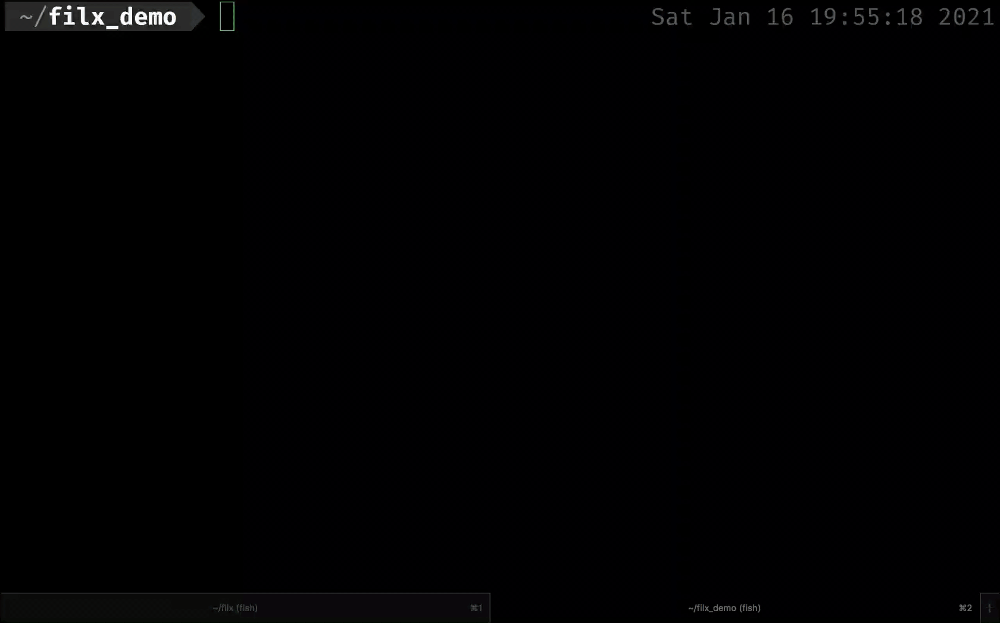
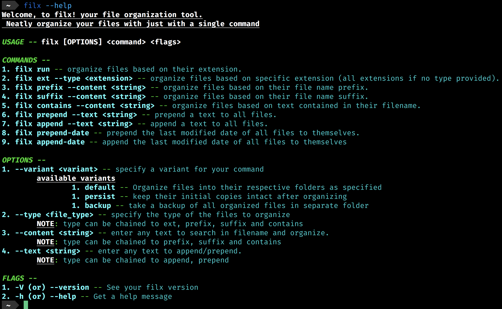

<h1 align="center">Filx</h1>
<div align="center">
  <strong>Your File Organization Tool</strong>
  <p>Organize your files neatly with one clean command</p>
</div>

---

## Demo

<div align="center">
    
</div>

## Installation

- Create a folder and inside the folder run,

```
wget https://raw.githubusercontent.com/Pradeep-selva/filx/master/filx
```

- Give the "filx" binary file executable permissions using,

```
chmod +x filx
```

- Add file to path. To add filx to your current shell run,

```
export PATH="$HOME/<your-folder>:$PATH"
```

- To add file to path permanently, add the above line to your `~/.bash_profile` or `~/.profile`

**(OR)**

- Run the following command

```
curl -LSfs https://japaric.github.io/trust/install.sh | sh -s -- --git Pradeep-selva/filx
```

- Add the binary to your path.

**(OR)**

- Using cargo, install the filx crate, using

```
cargo install filx
```

## Usage

- The following is the list of available commands, options and flags --

<div align="center">
    
</div>

- The options are can be chained, which enables running some complex commands.

Ex: To add the date modified to the start of file names for rust files containing "filx" in their name

```
filx prepend-date --content filx --type rs
```

Ex: To move all rust files end with "filx" to a folder named "filx" and take backup of it.

```
filx suffix --content filx --type rs --variant backup
```

## Built Using

- Rust
- [Trust](https://github.com/japaric/trust)
- structopt

## License

[MIT](LICENSE) © [Pradeep-selva](https://github.com/Pradeep-selva)
